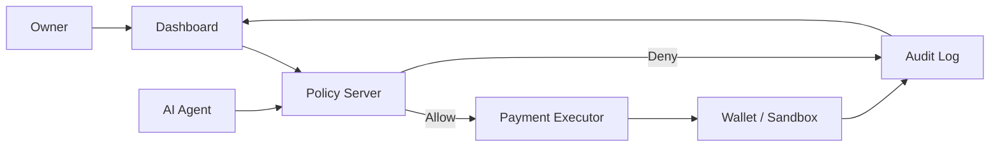
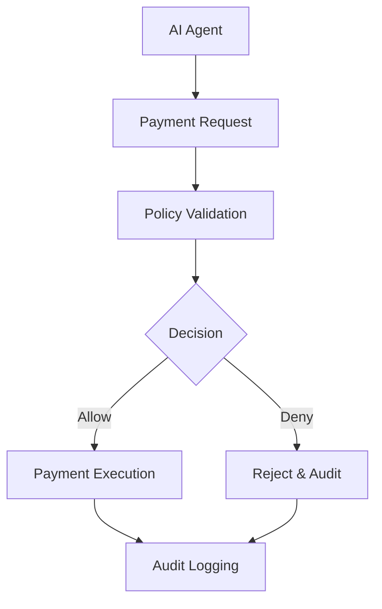

<div align="center">

# 🔐 AgentPay Guard

### Secure, policy-enforced payments for autonomous AI agents

A security-first control layer for AI agents that need to make payments without bypassing independent safeguards.

[](https://www.python.org/) [](https://fastapi.tiangolo.com/) [](https://react.dev/) [](https://vite.dev/) [](https://firebase.google.com/)

</div>

AgentPay Guard is a security layer for autonomous AI agents that need to make payments. Instead of trusting an agent to follow spending rules through prompt text alone, every payment request is validated by an independent backend that owns the execution path and enforces hard financial policies. The agent can request a payment, but it cannot bypass the safeguards.

> Built to stop unsafe money movement before it happens.

| Layer            | Role                                           |
| :--------------- | :--------------------------------------------- |
| Policy Server    | Evaluates each payment before execution        |
| Dashboard        | Lets owners configure limits and freeze agents |
| Payment Executor | Performs settlement only after approval        |
| Audit Log        | Records every decision for review              |

---

## Overview

Prompt-based payment restrictions are fragile. In practice, they can be undermined by prompt injection, jailbreaks, model bugs, or simple developer oversight. When an AI agent is allowed to act with financial authority without a separate enforcement layer, the system becomes vulnerable to overspending, unauthorized transfers, and inconsistent controls.

AgentPay Guard solves this by introducing a trustworthy policy boundary between the agent and the payment executor. The policy server evaluates every request independently, blocks unsafe actions, and logs the decision for later review.

> The AI agent never owns the payment credential path. The policy layer remains the source of truth.

---

## Why AgentPay Guard?

AgentPay Guard is built around a simple security philosophy: independent enforcement must exist outside the agent itself.

That means the system is designed to resist:

- Prompt Injection
- Jailbreaks
- Agent Bugs
- Unauthorized API Calls
- Direct Wallet Access

The result is a payment control system where policy validation happens server-side, before any money movement is allowed.

---

## Key Features

| Feature                      | What it does                                                          |
| :--------------------------- | :-------------------------------------------------------------------- |
| 🛡️ Independent Policy Engine | Evaluates each payment request with a separate, trusted policy layer. |
| 💰 Spending Limits           | Enforces per-transaction and daily cumulative limits.                 |
| 📋 Merchant Allowlist        | Accepts payments only for approved counterparties.                    |
| 🚨 Kill Switch               | Lets an owner freeze an agent instantly and block future payments.    |
| 📜 Audit Logs                | Records approvals, rejections, and policy decisions for review.       |
| ⚡ Real-Time Validation      | Rejects risky requests before execution.                              |
| 🔒 Server-Side Secrets       | Keeps payment credentials out of the agent and frontend layer.        |
| 🧠 Agent Isolation           | Prevents the AI from directly controlling the payment path.           |

---

## Architecture



The architecture is intentionally split into a control plane and an execution plane. The dashboard configures policy, the policy server evaluates requests, and the executor performs settlement only after approval.

---

## Payment Workflow



This workflow ensures that every payment is evaluated before execution and that every outcome is recorded.

---

## Threat Model

| Attack             | Status       | Explanation                                                                    |
| :----------------- | :----------- | :----------------------------------------------------------------------------- |
| Prompt Injection   | ✅ Mitigated | Server-side policy checks override prompt-based instructions.                  |
| Replay Attack      | ✅ Mitigated | Unique request identifiers and duplicate detection reduce replay risk.         |
| Overspending       | ✅ Mitigated | Hard per-transaction and daily spend ceilings are enforced.                    |
| Unknown Merchant   | ✅ Mitigated | Allowlist enforcement blocks unapproved counterparties.                        |
| Split Payments     | ✅ Mitigated | Policy checks can detect attempts to bypass limits through fragmentation.      |
| Frozen Agent       | ✅ Mitigated | The kill switch rejects all future requests when the agent is frozen.          |
| Velocity Attack    | ✅ Mitigated | Rate and repeat-pattern logic can be applied to suspicious request bursts.     |
| Duplicate Requests | ✅ Mitigated | Requests are logged and validated to prevent accidental or repeated execution. |

---

## Technology Stack

| Category   | Technology                            |
| :--------- | :------------------------------------ |
| Frontend   | React + Vite                          |
| Backend    | FastAPI                               |
| Auth       | Firebase Authentication               |
| Data Layer | Firebase Firestore / backend services |
| Language   | Python + JavaScript                   |
| Deployment | Render / Vercel-friendly architecture |

---

## Folder Structure

```text
AgentPay-Guard/
├── backend/
│   ├── app/
│   │   ├── api/
│   │   │   ├── endpoints/
│   │   │   └── ...
│   │   ├── core/
│   │   ├── db/
│   │   ├── models/
│   │   └── services/
│   ├── data/
│   ├── requirements.txt
│   ├── Procfile
│   └── render.yaml
├── frontend/
│   ├── src/
│   ├── package.json
│   ├── vite.config.js
│   └── vercel.json
├── contracts/
│   └── AgentPayGuard.sol
├── scripts/
│   └── deploy.js
├── hardhat.config.js
├── package.json
├── README.md
└── backend/firebase-key.json
```

---

## API Reference

| Method | Endpoint                                 | Purpose                                   |
| :----- | :--------------------------------------- | :---------------------------------------- |
| POST   | /api/v1/payments                         | Submit a payment request from an agent.   |
| POST   | /api/v1/agents/{id}/freeze               | Freeze an agent immediately.              |
| POST   | /api/v1/agents/{id}/unfreeze             | Re-enable an agent.                       |
| PUT    | /api/v1/agents/{id}/policy               | Update spend limits and policy settings.  |
| POST   | /api/v1/agents/{id}/allowlist            | Add an approved merchant.                 |
| DELETE | /api/v1/agents/{id}/allowlist/{merchant} | Remove a merchant from the allowlist.     |
| GET    | /api/v1/agents/{id}                      | Retrieve agent status and policy details. |
| GET    | /api/v1/agents/{id}/transactions         | Load transaction history.                 |

Interactive API docs are available at `/docs` when the backend is running.

---

## Installation

### 1. Clone the repository

```bash
git clone <repository-url>
cd AgentPay-Guard
```

### 2. Set up the backend

```bash
cd backend
python -m venv venv
```

Activate the environment:

```bash
# Windows (PowerShell)
venv\Scripts\Activate.ps1

# macOS / Linux
source venv/bin/activate
```

Install dependencies:

```bash
pip install -r requirements.txt
```

Set up your environment variables:

```bash
cp .env.example .env
```

Make sure to review the `.env` file and configure any necessary keys (e.g., `OPENAI_API_KEY`).
**Important**: If you see a `Failed to get firestore client: Your default credentials were not found` error, ensure that `FIREBASE_CREDENTIALS_PATH="firebase-key.json"` is set in your `.env` file and that the `firebase-key.json` file is present in the `backend/` directory.

If you intend to use the Hardhat local node, ensure you set `IS_BLOCKCHAIN_ENABLED=true` in this file.

Run the backend:

```bash
uvicorn app.main:app --reload
```

The API will be available at http://127.0.0.1:8000/docs.

### 3. Set up the frontend

Run in New Terminal

```bash
cd frontend
npm install
npm run dev
```

The frontend will be available at http://localhost:5173/.

### 4. Set up the Blockchain (Hardhat)

If blockchain features are enabled, you need to run a local Ethereum node and deploy the smart contract.

Run in a New Terminal from the root directory:

```bash
npm install
npx hardhat node
```

In another terminal, deploy the contracts to the local network:

```bash
npx hardhat run scripts/deploy.js --network localhost
```

The smart contract features will now be available for the backend to interact with.

---

## Project Screenshots

Placeholder assets for future documentation and demos:

- assets/dashboard.png
- assets/payment-flow.png
- assets/architecture.png

---

## Security Highlights

- [x] AI never owns the payment credential path
- [x] Independent policy validation runs before execution
- [x] Merchant allowlisting blocks unauthorized counterparties
- [x] Replay protection and request tracking are part of the design
- [x] Daily and per-transaction spending limits are enforced
- [x] Kill switch support enables rapid freeze behavior
- [x] Full audit logging supports incident review

---

## Attack Demonstrations

| Scenario                                        | Expected Result                             |
| :---------------------------------------------- | :------------------------------------------ |
| Prompt tries to raise the daily limit           | Request is denied by policy validation.     |
| Agent attempts a payment to an unknown merchant | The payment is blocked.                     |
| Overspend attempt after limit is reached        | The request fails before execution.         |
| Agent is frozen and then asked to pay           | The request is rejected immediately.        |
| Duplicate payment request arrives twice         | The second request is detected and blocked. |
