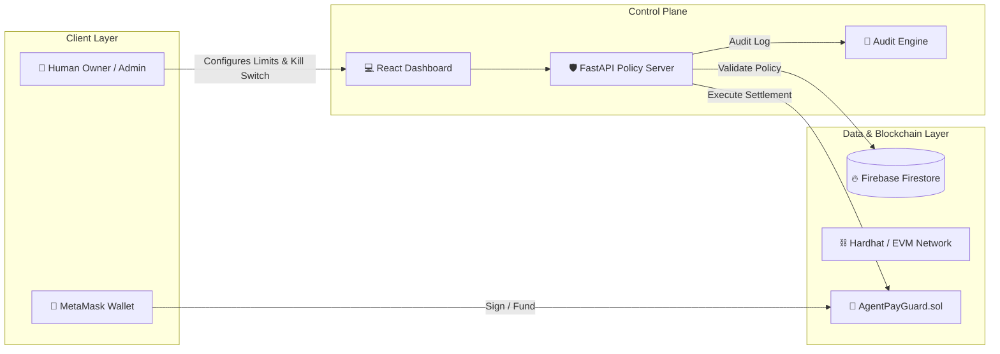
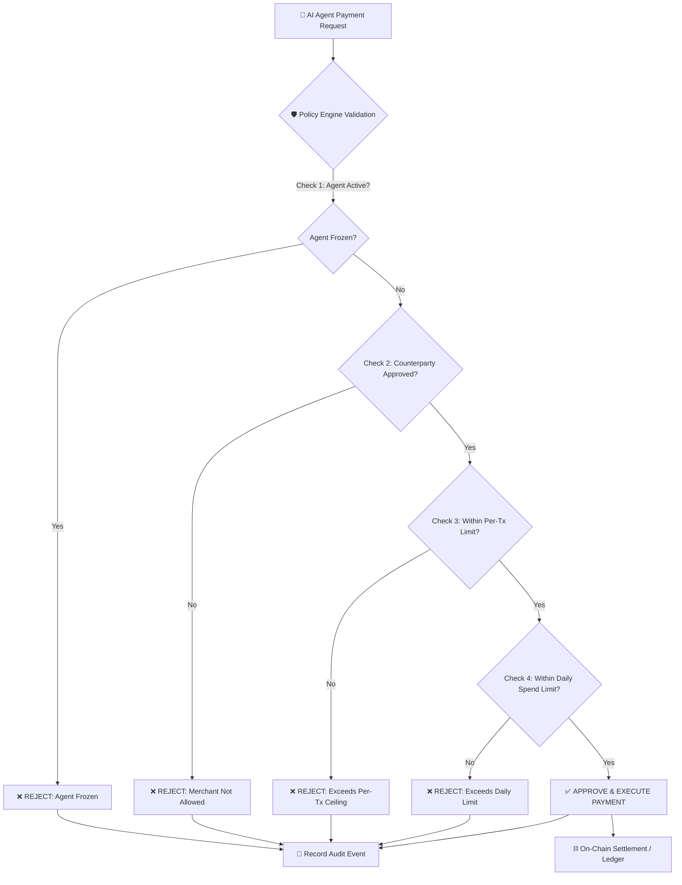

<div align="center">

# 🔐 AgentPay Guard

### _Secure, Policy-Enforced Autonomous AI Payments_

A security-first control and execution layer for AI agents that prevents financial overspending, unauthorized counterparties, and prompt-injection attacks.

[](https://www.python.org/)
[](https://fastapi.tiangolo.com/)
[](https://react.dev/)
[](https://vite.dev/)
[](https://firebase.google.com/)
[](https://soliditylang.org/)
[](https://hardhat.org/)

---

</div>

## 📌 Overview

Prompt-based financial boundaries are fragile. In autonomous AI agent workflows, relying on LLM prompt instructions alone opens up severe attack vectors: **prompt injection, jailbreaks, model hallucination, and compromised tools**.

**AgentPay Guard** resolves this risk by establishing an independent, server-side policy firewall between the AI agent and the payment settlement layer. The agent can _request_ payments, but it **never owns credentials, never touches private keys directly, and cannot bypass independent validation**.

🔗 **[Live Demo](https://agentpay-guard-a30d.onrender.com)**

> [!IMPORTANT] > **Core Security Philosophy**: The AI agent operates in an isolated, untrusted layer. Independent policy evaluation runs server-side before any money movement is authorized or broadcast on-chain.

---

## 🏗 System Architecture



### Payment Execution Workflow



---

## ✨ Key Features

| Feature                           | Description                                                               |
| :-------------------------------- | :------------------------------------------------------------------------ |
| **🛡️ Independent Policy Engine**  | Server-side validation completely isolated from LLM prompt text.          |
| **💰 Granular Spending Ceilings** | Hard per-transaction and daily cumulative spend limits.                   |
| **📋 Counterparty Allowlist**     | Restricts funds to verified, pre-approved merchants and target contracts. |
| **🚨 Emergency Kill Switch**      | Instantly freeze an agent's financial authority in real-time.             |
| **⛓️ Smart Contract Integration** | On-chain vault settlement (`AgentPayGuard.sol`) with Hardhat support.     |
| **📜 Transparent Audit Trail**    | Logs every attempt (allowed or denied) with risk metadata.                |
| **⚡ Real-Time Web Dashboard**    | Sleek, dark-mode control center for live telemetry and wallet state.      |

---

## 🛡 Threat Matrix & Defense Strategy

| Attack Vector                         | Defense Mechanism                              | Outcome                                |
| :------------------------------------ | :--------------------------------------------- | :------------------------------------- |
| **Prompt Injection**                  | Policy engine operates outside the LLM context | 🛑 Denied (Hard limits enforced)       |
| **Limit Escalation Attack**           | Limits stored server-side / on-chain only      | 🛑 Denied (Agent cannot mutate limits) |
| **Split-Payment (Cumulative Attack)** | Daily spend counter tracks aggregate sum       | 🛑 Denied (Daily cap triggers)         |
| **Malicious Address Redirection**     | Strict counterparty allowlist verification     | 🛑 Denied (Unlisted targets blocked)   |
| **Frozen Agent Exploitation**         | Global status state checked on every request   | 🛑 Denied (Immediate execution drop)   |

---

## ⚙️ Environment Configuration (`.env`)

Create a `.env` file inside the `backend/` directory by copying `.env.example`:

```bash
cp backend/.env.example backend/.env
```

### Complete Variable Reference

```env
# =============================================================================
# AgentPay Guard — Backend Environment Configuration
# =============================================================================

# -- Application Settings -----------------------------------------------------
APP_NAME="AgentPay Guard"
APP_VERSION="0.1.0"
DEBUG=false

# -- Server & CORS ------------------------------------------------------------
HOST=0.0.0.0
PORT=8000
CORS_ORIGINS='["*"]'

# -- Database Configuration ----------------------------------------------------
# Path to your Firebase Service Account Credentials JSON file (inside backend/)
FIREBASE_CREDENTIALS_PATH="firebase-key.json"

# -- Security ------------------------------------------------------------------
# Secret key for server session hashing (Generate: python -c "import secrets; print(secrets.token_hex(32))")
SECRET_KEY="replace-with-a-secure-random-token-in-production"

# -- Policy Engine Defaults ---------------------------------------------------
DEFAULT_PER_TRANSACTION_LIMIT=1000.0
DEFAULT_DAILY_LIMIT=5000.0
DEFAULT_MAX_REQUESTS_PER_MINUTE=10
PENDING_DELAY_SECONDS=5.0

# -- Blockchain / Smart Contract -----------------------------------------------
# Set to 'true' if using local Hardhat node or an EVM RPC network
IS_BLOCKCHAIN_ENABLED=true
RPC_PROVIDER_URL="http://127.0.0.1:8545"

# Deployed Smart Contract Address (Output from 'npx hardhat run scripts/deploy.js')
SMART_CONTRACT_ADDRESS="[YOUR-SMART-CONTRACT-ADDRESS]"

# Private key of deployer / agent operator account (Hardhat Account #0 by default)
AGENT_PRIVATE_KEY="[AGENT-PRIVATE-KEY]"
```

> [!NOTE] > **Firebase Credentials**: Ensure `firebase-key.json` exists in `backend/` and `FIREBASE_CREDENTIALS_PATH="firebase-key.json"` is set in your `.env`. Also ensure your Firebase console has **Cloud Firestore Database** enabled.

---

## 🚀 Quick Start Guide

### Prerequisites

- **Python**: 3.12 or higher
- **Node.js**: v18.0 or higher
- **Browser Extension**: [MetaMask](https://metamask.io/) (for Web3 wallet interactions)

---

### Step 1: Backend Setup

1. Navigate to the backend directory:

   ```bash
   cd backend
   ```

2. Create and activate a Python virtual environment:

   ```bash
   # Windows (PowerShell)
   python -m venv venv
   .\venv\Scripts\Activate.ps1

   # macOS / Linux
   python3 -m venv venv
   source venv/bin/activate
   ```

3. Install dependencies:

   ```bash
   pip install -r requirements.txt
   ```

4. Setup environment variables:

   ```bash
   cp .env.example .env
   ```

5. Start the FastAPI backend:

   ```bash
   uvicorn app.main:app --reload
   ```

   The backend API will run at `http://localhost:8000`. Interactive API Docs are available at `http://localhost:8000/docs`.

---

### Step 2: Frontend Setup

Open a **new terminal** and run:

1. Navigate to the frontend directory:

   ```bash
   cd frontend
   ```

2. Install dependencies:

   ```bash
   npm install
   ```

3. Launch the Vite development server:

   ```bash
   npm run dev
   ```

   The user interface will be live at `http://localhost:5173`.

---

### Step 3: Local Blockchain Setup (Hardhat)

To enable on-chain smart contract settlement:

1. Open a **third terminal** in the root project folder and start the local Ethereum node:

   ```bash
   npx hardhat node
   ```

2. In a **fourth terminal**, deploy the `AgentPayGuard` contract to the local node:

   ```bash
   npx hardhat run scripts/deploy.js --network localhost
   ```

3. Copy the contract address printed in the terminal (e.g. `0x5Fb....aa3`) into your `backend/.env` file under `SMART_CONTRACT_ADDRESS` and set `IS_BLOCKCHAIN_ENABLED=true`.

---

## 🔌 API Specification

| Endpoint                              | Method   | Purpose                                      |
| :------------------------------------ | :------- | :------------------------------------------- |
| `/api/v1/agents`                      | `GET`    | List all monitored AI agents & metrics       |
| `/api/v1/agents/{id}`                 | `GET`    | Get details for a specific agent             |
| `/api/v1/agents/{id}/freeze`          | `POST`   | Trigger emergency kill switch (Freeze agent) |
| `/api/v1/agents/{id}/unfreeze`        | `POST`   | Restore agent financial authority            |
| `/api/v1/agents/{id}/policy`          | `PUT`    | Update per-transaction or daily spend limits |
| `/api/v1/agents/{id}/allowlist`       | `POST`   | Add a new approved merchant destination      |
| `/api/v1/agents/{id}/allowlist/{mid}` | `DELETE` | Remove a merchant from the allowlist         |
| `/api/v1/payments`                    | `POST`   | Submit an AI agent payment request           |
| `/api/v1/agents/{id}/transactions`    | `GET`    | Retrieve complete audit trail & log history  |

---

## 📁 Repository Structure

```text
AgentPay-Guard/
├── backend/
│   ├── app/
│   │   ├── api/
│   │   │   └── endpoints/     # FastAPI route definitions (agents, payments, AI)
│   │   ├── core/              # Config, constants, settings
│   │   ├── db/                # Firebase Firestore client & seed script
│   │   ├── models/            # Domain data structures (Agent, Merchant, Tx)
│   │   └── services/          # Policy evaluator, chain interaction, allowlist
│   ├── firebase-key.json      # Service Account Credentials (Git-ignored)
│   ├── .env.example           # Environment template
│   └── requirements.txt       # Python dependencies
├── frontend/
│   ├── src/
│   │   ├── components/        # UI components & views
│   │   ├── App.jsx            # Main dashboard application logic
│   │   └── api.js             # REST API integration client
│   └── package.json
├── contracts/
│   └── AgentPayGuard.sol      # Solidity smart contract guard vault
├── scripts/
│   └── deploy.js              # Hardhat contract deployment script
├── hardhat.config.js          # Hardhat EVM network configuration
└── README.md
```

---

<div align="center">

**AgentPay Guard** — _Autonomous Agent Payments with Absolute Financial Integrity._

</div>
